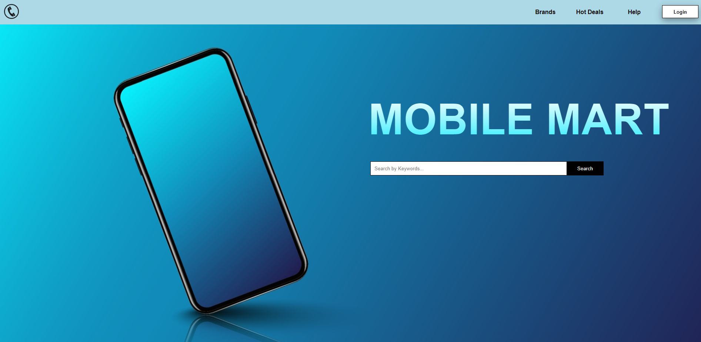
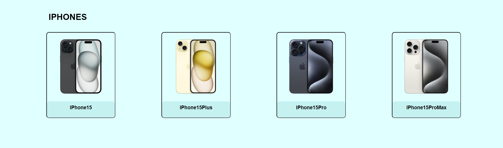
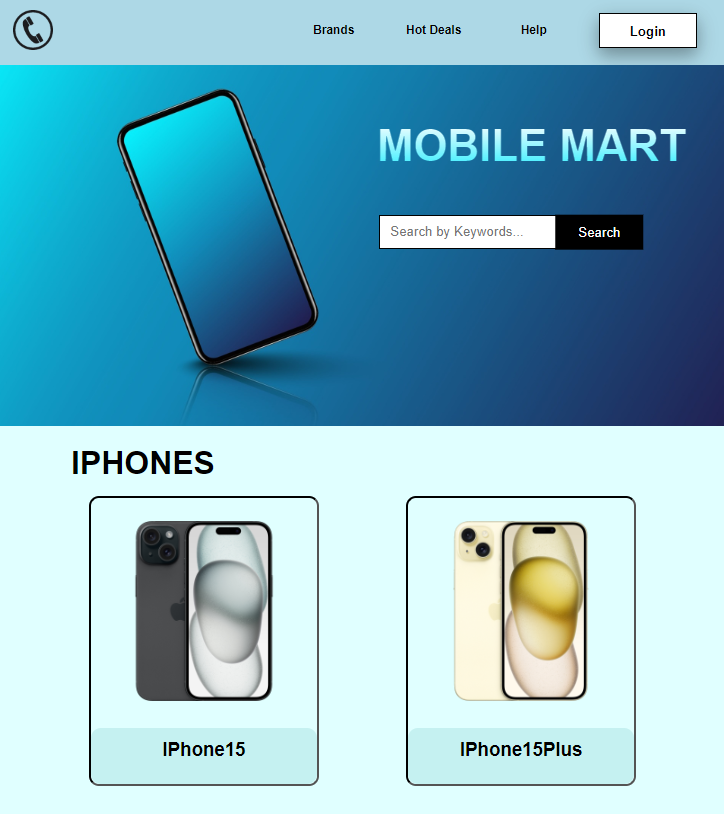
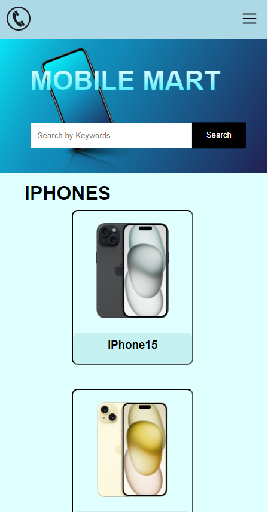

# Mission Ready Level 5 Mission 0 Project

A basic frontend webpage showcasing responsive design. See images below.

Responsiveness was implemented using media queries with 5 breakpoints.

### Technologies Used
- React
- JSX and CSS

### React Components
- NavBar.jsx
- SearchBar.jsx
- Product.jsx

# Website Screenshots

### Full Size

### Medium Size

### Mobile Size

